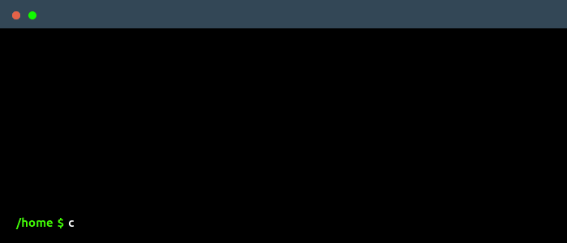

<!--
    Привет, это Макс Коцюба!
    Вижу, ты исследуешь мой код Readme
    Мне очень приятно осознавать, что кого-то может вдохновить мой профиль
    
    Буду рад, если подпишешься, у меня будет много нового и интересного
    Можешь также связаться со мной на LinkedIn @Ссылочка
-->

 

<!--
    Можешь создать свою гифку с терминалом здесь -> https://www.terminalgif.com
-->

    

<!--
     Блок с небольшим описанием
-->

### My purpose
I`am truly keen on data and everything related. Data structures, Data processing, databases, building complex ETL\ELT processes are exactly the directions in which I found myslf. Solving complex problems has become an integral part of my life and my entire career is somehow connected with data analytics, data science and data engineering - directions in which I am constantly developing.

<!--
    Список моих навыков и инструментов, которые я изучаю!
-->

### Main skills

### Studying

<!--
     Сюда еще добавить всякие штуки
-->

### :mortar_board: Education:

#### • Higher School of Economics <ins>2026</ins>
&emsp;*Faculty of Computer Science.* CGPA/Percentage: **?**

#### • Presidential Academy of National Economy and Public Administration <ins>2024</ins>
&emsp;*Faculty of Finance and Banking. Master‘s degree with honors.* CGPA/Percentage: **4.9**

#### • Moscow State Institute of International Relations <ins>2018</ins>
&emsp;*Faculty of Applied Economics and Commerce. Bachelor‘s degree.* CGPA/Percentage: **4.5**

### :briefcase: Working Experience

#### • SBER  (<ins>Data engineer</ins>. Moscow)
*Jul 2024 - Now*

*
* 

#### • VTB Bank  (<ins>Data engineer (Head of the division)</ins>. Moscow)
*Aug 2023 - Jul 2024*

* ETL jobs integration into AML data pipelines.
* Feature engineering for ML development.

#### • VTB Bank (<ins>Data engineer</ins>. Moscow)
*Jan 2023 - Aug 2023*

* Participated in DWH development using Teradata and SAS
* Improved the efficiency of banking complience procedures

#### • VTB Bank (<ins>Data analyst</ins>. Moscow)
*Oct 2020 - Dec 2022*

* DWH analysis and ETL process management in the field of anti-money laundering
* Improved the efficiency of banking complience procedures

#### Ministry of Defence of the Russian Federation (<ins>Data analyst</ins>. Moscow)
*Sep 2019 - Sep 2020*
* Data analysis in government anti-fraud activities
* Management reporting automation

### About me

### My project 

<!--
     Блок для рекрутеров!
-->
### Employer?
> [!IMPORTANT]  
> <a href="https://drive.google.com/file/d/1_nbRBwiKkYfAfIAEsZAq_WU37PXKeKoB/view?usp=sharing" download>Download my resume</a>

:trollface:
<!--
     Спасибо за визит <3
-->
